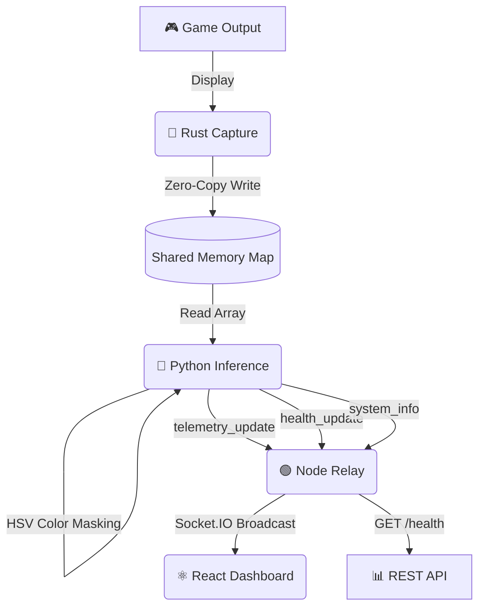

<div align="center">
  

  **A High-Performance Real-Time Gaming Telemetry Pipeline**
  
  [](https://www.rust-lang.org/)
  [](https://www.python.org/)
  [](https://nodejs.org/)
  [](https://reactjs.org/)
</div>

---

## ⚡ Overview

**Telemetry Engine** is a modular, zero-copy architecture designed for real-time gaming analytics. It captures high-framerate video data from a primary display, processes it instantaneously to extract vital game state metrics (like health bars, stamina, mana, and minimap data), and broadcasts the results to a beautiful, glassmorphic web dashboard.

### Key Features

- 🎮 **Multi-Metric Extraction** — Health (Red), Stamina (Green), Mana/Shield (Blue) detection via HSV color masking
- 📊 **Live Sparkline Graphs** — Real-time canvas-rendered trend charts for all metrics
- ⚡ **Rolling FPS Calculator** — 30-frame window FPS tracking with live display
- ☀️ **Brightness Detection** — Scene brightness monitoring for loading screen/dark scene detection
- 🖥️ **System Info Panel** — Live Python version, OpenCV version, capture resolution display
- 📋 **Event Log** — Timestamped connection events, health warnings, and data stream status
- 🔌 **REST Health Check** — `GET /health` endpoint on the relay for monitoring
- 👥 **Client Tracking** — Live connected client count broadcast
- 🎨 **Glassmorphic UI** — Premium dark-mode dashboard with animated particles, shimmer effects, and micro-animations

---

## 🏗️ Architecture

The engine uses a four-stage pipeline to guarantee minimum latency between the game screen and the analytics dashboard.



### Pipeline Stages

1.  **Rust Capture (`/capture`)**: Blazing fast screen capture using `scrap` and the Windows API. Writes uncompressed BGRA frames directly into a named shared memory map (`TelemetryFrame`) with a 16-byte header (width, height, channels, frame counter).

2.  **Python Inference (`/inference`)**: Reads the shared memory segment directly, mapping it to a NumPy array. Applies OpenCV (`cv2`) HSV color filtering to calculate multiple metrics:
    - **Health** — Red pixel ratio (HSV `[0-10, 120-255, 70-255]` + `[170-180, 120-255, 70-255]`)
    - **Stamina** — Green pixel ratio (HSV `[35-85, 120-255, 70-255]`)
    - **Mana** — Blue pixel ratio (HSV `[100-130, 120-255, 70-255]`)
    - **FPS** — Rolling 30-frame window calculation
    - **Brightness** — Mean Value channel from HSV conversion
    - Emits `telemetry_update`, `health_update`, and `system_info` events via Socket.IO

3.  **Node Relay (`/relay`)**: A Socket.IO + HTTP server that acts as a central hub:
    - Routes `telemetry_update`, `health_update`, and `system_info` from Python to all frontends
    - Injects server-side timestamps into all payloads
    - Tracks connected clients and broadcasts `client_count` updates
    - Exposes `GET /health` REST endpoint for uptime/status monitoring

4.  **React Dashboard (`/dashboard`)**: A Vite-powered React UI featuring:
    - Three animated health bars (Health, Stamina, Mana) with dynamic color transitions
    - Four real-time sparkline graphs (Health Trend, FPS, Stamina Trend, Mana Trend)
    - Stats row showing FPS, frame count, brightness, and connected clients
    - System info panel with capture resolution and library versions
    - Timestamped event log with categorized entries
    - Animated background particles and glassmorphic card design

---

## 🚀 Getting Started

### Prerequisites

Ensure you have the following installed on your system:
- **Rust & Cargo** (for the capture module)
- **Python 3.8+** with `pip` (for inference)
- **Node.js v18+** (for the relay and dashboard)
- **Visual Studio Build Tools** (for Rust MSVC linker on Windows)

### Quick Start

The fastest way to launch everything:

```powershell
.\start.ps1
```

This opens four terminal windows — one for each pipeline stage. To stop everything:

```powershell
.\stop.ps1
```

### Manual Setup

#### 1. Start the Node Relay
```bash
cd relay
npm install
node index.js
```
*The relay runs on `http://localhost:4000` with health check at `http://localhost:4000/health`*

#### 2. Launch the React Dashboard
```bash
cd dashboard
npm install
npm run dev
```
*Open your browser to the local Vite URL (usually `http://localhost:5173`)*

#### 3. Run the Python Inference
```bash
cd inference
pip install -r requirements.txt
python main.py
```

#### 4. Start the Rust Capture
```bash
cd capture
cargo run --release
```

---

## 🎨 Visuals & UI

The React dashboard was designed with a focus on **impactful aesthetics**:

- **Glassmorphism** — Translucent panels with 24px backdrop blur and dynamic drop shadows
- **Animated Particles** — Floating gradient orbs in the background with gentle float animation
- **Micro-animations** — Shimmer overlays on health bars, pulse-glow status dots, fade-slide event entries
- **Dynamic Coloring** — Each bar transitions through custom color stops based on value thresholds
- **Sparkline Charts** — Canvas-rendered smooth bezier curves with gradient fills and endpoint dots
- **Responsive Grid** — Adapts from 4-column stats to 2-column and single-column on mobile
- **JetBrains Mono** — Monospace font for all numerical values and timestamps

---

## 📁 Project Structure

```
TELEMETRY_ENGINE/
├── capture/            # 🦀 Rust screen capture module
│   ├── Cargo.toml
│   └── src/
│       └── main.rs
├── inference/          # 🐍 Python inference engine
│   ├── main.py
│   └── requirements.txt
├── relay/              # 🟢 Node.js Socket.IO relay
│   ├── index.js
│   └── package.json
├── dashboard/          # ⚛️ React Vite dashboard
│   ├── index.html
│   ├── package.json
│   ├── vite.config.js
│   └── src/
│       ├── App.jsx
│       ├── index.css
│       ├── main.jsx
│       └── components/
│           ├── EventLog.jsx
│           ├── HealthBar.jsx
│           ├── SparklineGraph.jsx
│           ├── StatsRow.jsx
│           └── SystemInfo.jsx
├── start.ps1           # 🚀 Launch all services
├── stop.ps1            # 🛑 Stop all services
├── .gitignore
└── README.md
```

---

## 📡 API Reference

### Socket.IO Events

| Event | Direction | Payload |
|---|---|---|
| `telemetry_update` | Inference → Relay → Dashboard | `{ health, stamina, mana, fps, frame_count, resolution, brightness, red_ratio, green_ratio, blue_ratio, timestamp }` |
| `health_update` | Inference → Relay → Dashboard | `{ health }` |
| `system_info` | Inference → Relay → Dashboard | `{ python_version, opencv_version, capture_resolution }` |
| `client_count` | Relay → Dashboard | `{ count, timestamp }` |

### REST Endpoints

| Method | Path | Response |
|---|---|---|
| `GET` | `/health` | `{ status, uptime, connectedClients, timestamp }` |
| `GET` | `/` | `{ name, status, endpoints, connectedClients }` |

---

<div align="center">
  <i>Built with ❤️ for gamers and developers.</i>
</div>
