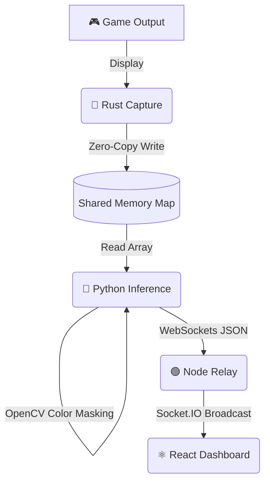

<div align="center">
  

  **A High-Performance Real-Time Gaming Telemetry Pipeline**
  
  [](https://www.rust-lang.org/)
  [](https://www.python.org/)
  [](https://nodejs.org/)
  [](https://reactjs.org/)
</div>

---

## ⚡ Overview

**Telemetry Engine** is a modular, zero-copy architecture designed for real-time gaming analytics. It captures high-framerate video data from a primary display, processes it instantaneously to extract vital game state metrics (like health bars, stamina, or minimap data), and broadcasts the results to a beautiful, glassmorphic web dashboard.

This MVP demonstrates a **Health Bar Tracker**, using color threshold masking to evaluate player status seamlessly in real-time.

## 🏗️ Architecture

The engine uses a four-stage pipeline to guarantee minimum latency between the game screen and the analytics dashboard.



1. **Rust Capture (`/capture`)**: Blazing fast screen capture using `scrap` and the Windows API to write uncompressed RGBA frames directly into a named shared memory map (`TelemetryFrame`).
2. **Python Inference (`/inference`)**: Reads the shared memory segment directly, mapping it to a NumPy array. Applies OpenCV (`cv2`) HSV color filtering to calculate metrics (e.g., % of red pixels representing health) and emits JSON.
3. **Node Relay (`/relay`)**: A lightweight Socket.IO server that acts as a central hub, receiving payloads from the Python backend and broadcasting them to all connected frontend clients.
4. **React Dashboard (`/dashboard`)**: A Vite-powered React UI featuring a modern, dark-mode glassmorphic aesthetic. Provides a large, glowing, live-updating progress bar.

---

## 🚀 Getting Started

### Prerequisites

Ensure you have the following installed on your system:
- **Rust & Cargo** (for the capture module)
- **Python 3.8+** (for inference)
- **Node.js v18+** (for the relay and dashboard)

### 1. Start the Node Relay
The relay routes messages from Python to React.
```bash
cd relay
npm install
node index.js
```
*The relay runs on `http://localhost:4000`*

### 2. Launch the React Dashboard
The frontend UI to visualize the telemetry.
```bash
cd dashboard
npm install
npm run dev
```
*Open your browser to the local Vite URL (usually `http://localhost:5173`)*

### 3. Run the Python Inference
Reads frames and calculates metrics.
```bash
cd inference
pip install -r requirements.txt
python main.py
```

### 4. Start the Rust Capture
Captures the screen and writes to shared memory.
```bash
cd capture
cargo run --release
```

---

## 🎨 Visuals & UI

The React dashboard was designed with a focus on **impactful aesthetics**:
- **Glassmorphism**: Translucent panels with background blur and dynamic drop shadows.
- **Micro-animations**: A shimmering overlay on the health bar, smooth width transitions, and a pulsating "LIVE" connection dot.
- **Dynamic Coloring**: The health bar transitions from Emerald Green (>60%) to Yellow (>30%) to Red (<30%) in real-time based on the incoming game data.

---

<div align="center">
  <i>Built with ❤️ for gamers and developers.</i>
</div>
